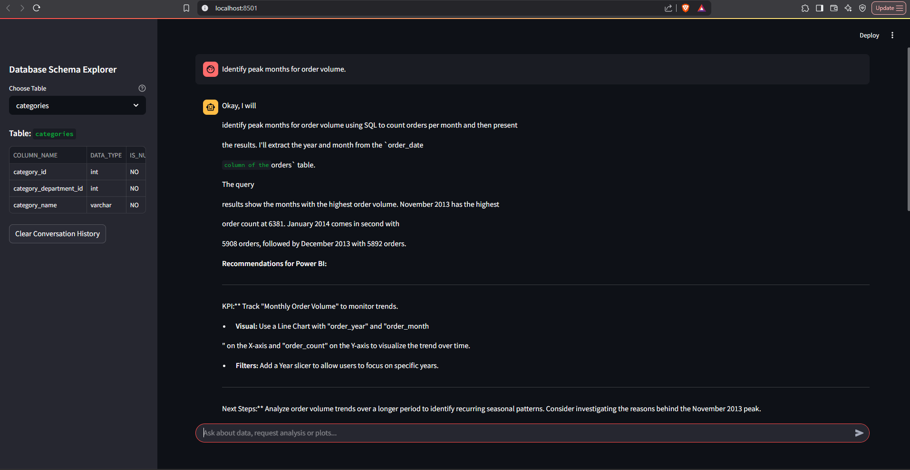

# Retail Data Analyst Agent 🤖📊

**AI-Powered Data Exploration & Dashboard Preparation Tool for Retail Analytics**

[](https://www.python.org/downloads/)
[](https://streamlit.io/)
[](https://opensource.org/licenses/MIT)

 
 


An intelligent assistant that helps data analysts explore retail databases, generate insights, and prepare Power BI dashboards using natural language queries powered by Google's GenAI.

## Key Features

- **Natural Language Interface**: Ask questions in plain English
- **AI-Powered Analysis**:
  - Automated SQL query generation
  - Data quality assessment
  - Trend identification
  - Anomaly detection
- **Smart Visualization**:
  - Automatic Plotly/Matplotlib chart generation
  - Interactive visual exploration
- **Power BI Integration**:
  - Dashboard design recommendations
  - KPI suggestions
  - Data modeling advice
- **Conversation History**: Maintains context-aware chat history
- **Database Explorer**: Interactive schema inspection

## ⚙️ Installation

1. **Clone Repository**
Make sure you are in `dev` branch
```bash
https://github.com/fmWaithaka/data_ai_agent.git
cd retail-ai-analyst
```

2. **Set Up Virtual Environment**
```bash
python -m venv venv
source venv/bin/activate  # Linux/Mac
venv\Scripts\activate  # Windows
```

3. **Install Dependencies**
```bash
pip install -r requirements.txt
```

4. **Configuration**
Create `.env` file:
```ini
DB_HOST=localhost
DB_PORT=3306
DB_USER=your_user
DB_PASSWORD=your_password
DB_NAME=retail_db
GOOGLE_API_KEY=your_api_key
```

## 🖥️ Usage

1. **Start Application**
```bash
streamlit run app.py
```

2. **Interact with the Agent**
- Ask data questions:
  *"Show monthly sales trends for electronics category"*
- Request visualizations:
  *"Create a bar chart of top selling products"*
- Get Power BI advice:
  *"Suggest KPIs for customer segmentation dashboard"*

3. **Explore Features**
- Use sidebar for database schema inspection
- Click "Clear History" to restart conversations
- Expand SQL queries to see generated code

## 📂 Project Structure

```
retail-ai-analyst/
├── app.py                 # Main application
├── config.py              # Configuration settings
├── services/
│   ├── ai_client.py       # GenAI client setup
│   └── tool_handler.py    # Function orchestration
├── utils/
│   ├── db_utils.py        # Database operations
│   ├── ui_components.py   # Streamlit UI elements
│   └── custom_types.py    # Type definitions
├── requirements.txt       # Dependencies
└── .env.example           # Environment template
```

### Prerequisites

- **SQL Client:** You can use any SQL client (e.g., MySQL Workbench, pgAdmin) to run these queries.
- **Database Access:** Ensure you have access to a structured database (MySQL, PostgreSQL, etc.).
- **Google API Key:** Get the API from [Google AI Studio](https://aistudio.google.com/prompts/new_chat)

### Configuration

| Environment Variable | Description                  | Example              |
|----------------------|------------------------------|----------------------|
| `DB_HOST`            | Database host address        | `localhost`          |
| `DB_PORT`            | Database port                | `3306`               |
| `DB_USER`            | Database username            | `retail_user`        |
| `DB_PASSWORD`        | Database password            | `secure_password`    |
| `DB_NAME`            | Database name                | `retail_db`          |
| `GOOGLE_API_KEY`     | Google GenAI API key         | `A...`          |

---

## Contributing

Contributions and suggestions are welcome! To contribute:

1. Fork the repository.
2. Create a feature branch: `git checkout -b feature-new-queries`
3. Commit your changes: `git commit -m 'Add new SQL analysis examples'`
4. Push to your branch: `git push origin feature-new-queries`
5. Open a Pull Request.

---

## License

This project is licensed under the MIT License. See the [LICENSE](LICENSE) file for details.

---

## Acknowledgments

- Google GenAI Team
- Kaggle GenAI intensive course
- Streamlit Community
- MySelf

---

## Final Note

This repository is a starting point for data analysts who want to leverage the power of SQL for data exploration, cleaning, and insights generation. Whether you're dealing with retail data, financial data, or any other structured data, mastering these SQL techniques can lead to smarter decision-making and more powerful analytics.

Happy Analyzing! 
